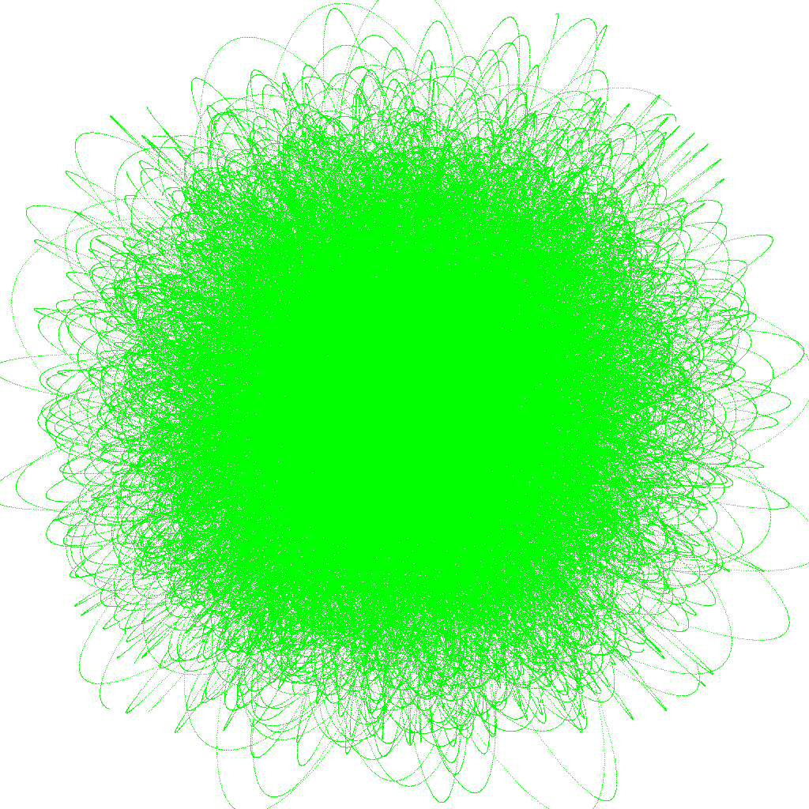

# Particle compute shader

This demo uses [go-gl](https://github.com/go-gl/gl) to load an OpenGL compute shader and simulate a number of particles in space. Loosely based on Mike Bailey's ["How to Use and Teach OpenGL Compute Shaders"](https://www.khronos.org/assets/uploads/developers/library/2014-siggraph-bof/KITE-BOF_Aug14.pdf) slides.

